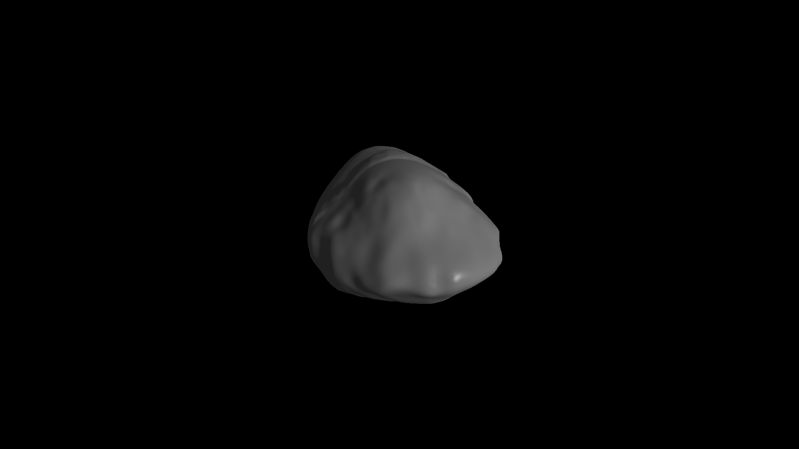

---
jupytext:
  text_representation:
    extension: .md
    format_name: myst
    format_version: 0.13
    jupytext_version: 1.14.0
kernelspec:
  display_name: Python 3 (ipykernel)
  language: python
  name: python3
---

# 3D Asteroid and Comet Visualization

## Overview
This enhancement adds a **3D visualization feature** to **Hapsira**, rendering precise models of asteroids and comets using **SPICE Digital Shape Kernel (DSK) files**. The visualization leverages the **Vispy** library for rendering, offering interactive exploration of shape and topography data. Additionally, a **bash script** automates the conversion of `.bds` files into `.obj` files using `dskexp` on Linux systems.


### Bash Script for BDS to OBJ Conversion

If your data file downloaded from **NAIF kernel** dsk is .bds format, you might have to convert the file into text format that is .obj. Link for [NAIF Kernels](https://naif.jpl.nasa.gov/pub/naif/generic_kernels/) is provided.

To use the .sh toolkit for conversion, cd into the directory where the setup_dskexp.sh file is located and run the following command:

```bash
source setup_dskexp.sh
```
```bash
dskexp -dsk filename.bds -text filename.obj -format obj -prec 10
```

### Key Features

The module includes the following steps:
* Load the 3D model data from a file.
* Create a MainWindow instance.
* Set the 3D model in the MainWindow.
* Run the Vispy application.

```{code-cell} ipython3
from hapsira.render.data_loader import load_data
from hapsira.render.scene import MainWindow
from vispy import app
```

```{code-cell} ipython3
vertices, faces = load_data("ROS_ST_K020_OSPCLAM_U_V1.OBJ")
main_w = MainWindow()
main_w.set_model(vertices, faces)
```

```{code-cell} ipython3
app.run()
```



## Author

**Rahul Ranjan Sah, Furman University**

## References
- https://naif.jpl.nasa.gov/pub/naif/generic_kernels/
- https://spiceypy.readthedocs.io/_/downloads/en/stable/pdf/
- https://vispy.org/